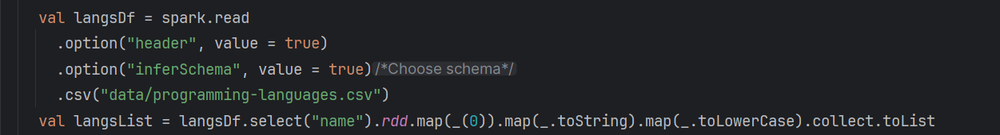
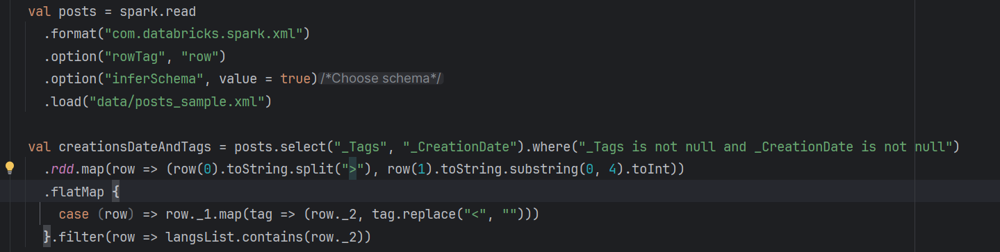
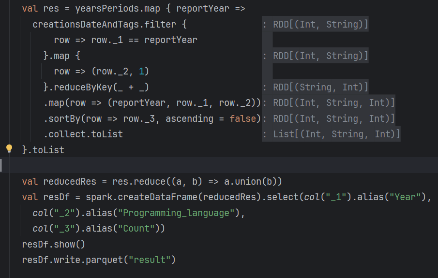
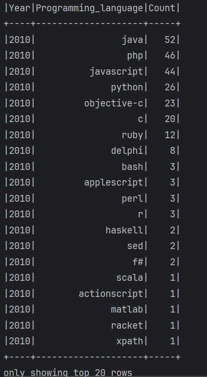
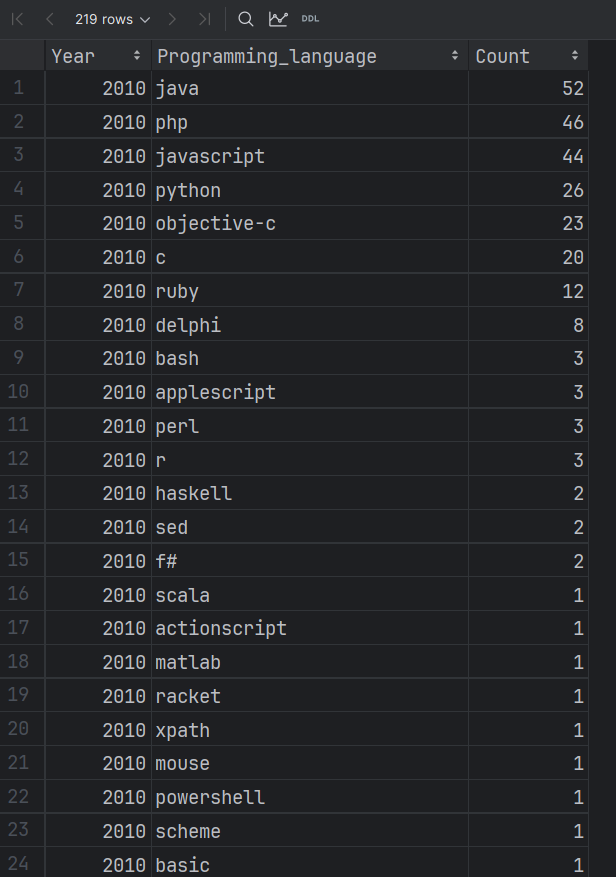

# Лабораторная 2. Формирование отчётов в Apache Spark

**Задание**

Сформировать отчёт с информацией о 10 наиболее популярных языках программирования по итогам года за период с 2010 по 2020 годы. Отчёт будет отражать динамику изменения популярности языков программирования и представлять собой набор таблиц "топ-10" для каждого года.

Получившийся отчёт сохранить в формате Apache Parquet.

Для выполнения задания вы можете использовать любую комбинацию Spark API: RDD API, Dataset API, SQL API.

**Ход работы**

В начале были распаршен и обработан файл programming-languages.csv

После чего был распаршен и обработан файл posts_sample.xml с помощью библиотеки com.databricks.spark.xml
, а также подготовлена коллекция creationsDateAndTags, которая ставила каждому году создания публикации в соответствие тег

Далее был написан подсчет количества упоминания языков в публикациях и сохранение результата в формате Apache Parquet

Результаты вывода в консоль:

Результаты сохранения в формате Apache Parquet:
